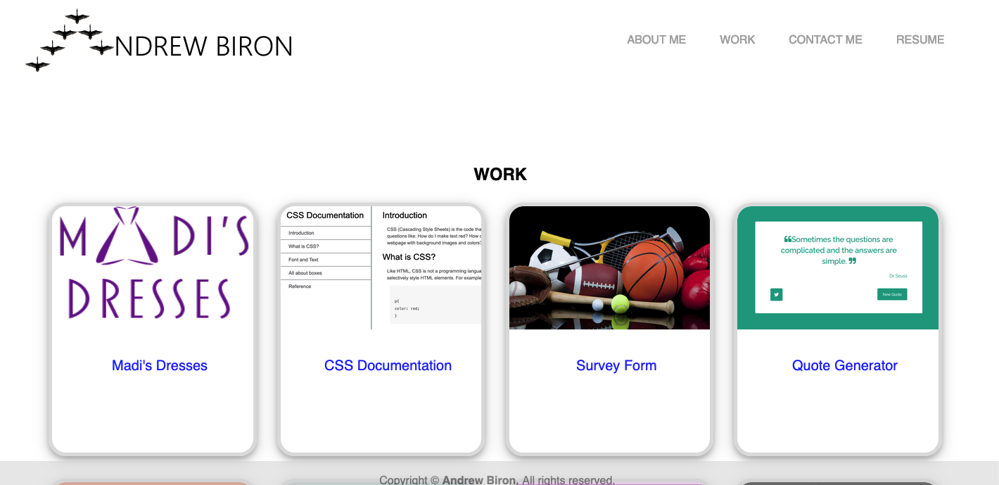

# Portfolio

## Building a Portfolio

The purpose of this project is to created a portfolio to demonstrate my abilities as a multimedia developer. I have had other portfolio websites before,
and this is the first portfolio website that was built from scratch. It was important that it was done well. I learnt that it requires a lot of thought
to structure a website to be responsive.  

The following is an image of my portfolio Website. 
 

## Installation

N/A

## Usage

To use the website, simply click the following link: https://gah-mewbittik.github.io/Portfolio/
From there you will be able to navigate through the website from the websites' links: ABOUT ME, WORK, CONTACT ME, and RESUME. An additional note, under the WORK section, you can click any of the project tiles to view and experiment with the actual projects. 

## Credits

N/A

## License

Please refer to the LICENSE in the repo.

